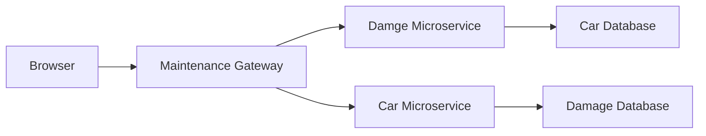

# Maintenance Gateway

## Table of Contents 
1. [Overview](#overview) 
    - [Purpose](#purpose) 
    - [Key Responsibilities](#key-responsibilities) 
    - [Roles Required](#roles-required)
2. [Features](#features) 
3. [Technology Stack](#technology-stack) 
4. [Environment Variables](#environment-variables) 
5. [Routing Configuration](#routing-configuration) 
6. [Endpoints](#endpoints) 
    - [Base URL](#base-url) 
    - [Endpoint Documentation](#endpoint-documentation) 
7. [Swagger Documentation](#swagger-documentation) 


## Overview
### Purpose
Acts as a central access point for routing requests between the car and damage management microservices in the architecture.

### Key Responsibilities
- Request forwarding and routing between services
- Centralized authentication and authorization
- Error handling and response standardization
- Service health monitoring

## Architecture
### Diagram



### Roles Required
Different roles are required for different endpoints:
- admin
- maintenance
- user

## Features
- Reverse proxy for routing requests to car and damage services
- Centralized authentication via JWT cookies
- Standardized error handling and response formatting
- Comprehensive health checking
- Swagger/OpenAPI documentation for all endpoints

## Technology Stack
- **Programming Language**: Python
- **Framework**: Flask
- **API Documentation**: Swagger/OpenAPI using Flasgger
- **HTTP Client**: Requests library
- **Deployment**: Azure Web App (Docker container)
- **CI/CD**: GitHub Actions

## Environment Variables
| Variable               | Description                               |
|-----------------------|-------------------------------------------|
| SECRET_KEY            | Secret key for the application            |
| USER_MICROSERVICE_URL | URL for the user microservice             |
| CAR_MICROSERVICE_URL  | URL for the car microservice              |
| DAMAGE_MICROSERVICE_URL| URL for the damage microservice           |

## Routing Configuration
The gateway routes requests to three main microservices:
```python
MICROSERVICES = {
    "user": "http://localhost:5005"
    "car": "http://localhost:5006"
    "damage": "http://localhost:5007"
}
```

## Endpoints
### Base URL
- **Production**: https://maintenance-gateway-ath4htbtdba4h4hw.northeurope-01.azurewebsites.net/

### Endpoint Documentation

| Method | Endpoint                                          | Description                                     |       
|--------|---------------------------------------------------|-------------------------------------------------|
| GET    | /cars                                             | Retrieve all cars                               | 
| GET    | /cars/<id>                                        | Retrieve car details by ID                      |
| PATCH  | /cars/<id>                                        | Update car details                              |
| GET    | /damage-types                                     | Retrieve all damage types                       |
| POST   | /damage-types                                     | Create new damage type                          |
| PATCH  | /damage-types/<id>                                | Update damage type                              |
| DELETE | /damage-types/<id>                                | Delete damage type                              |
| GET    | /damage-reports                                   | Retrieve all damage reports                     |
| POST   | /damage-reports                                   | Create new damage report                        |
| GET    | /damage-reports/<id>                              | Retrieve damage report by ID                    |
| PATCH  | /damage-reports/<id>                              | Update damage report                            |
| DELETE | /damage-reports/<id>                              | Delete damage report                            |
| GET    | /damage-reports/cars/<id>                         | Get damage reports for specific car             |
| GET    | /damage-reports/subscriptions/<id>                | Get damage reports for specific subscription    |
| GET    | /damage-reports/subscriptions/<id>/total-cost     | Get total damage costs for subscription         |
| POST   | /login                                            | Authenticate user and set cookies               |
| GET    | /health                                           | Check gateway health status                     |

All endpoints return standardized responses:
- Success responses (200, 201, 204) return the data from the microservice
- Error responses include:
  ```json
  {
      "error": "Failed to fetch from microservice",
      "data_returned_from_microservice": [data]
  }
  ```

## Swagger Documentation 
Swagger UI is available at [Swagger](https://maintenance-gateway-ath4htbtdba4h4hw.northeurope-01.azurewebsites.net/docs)